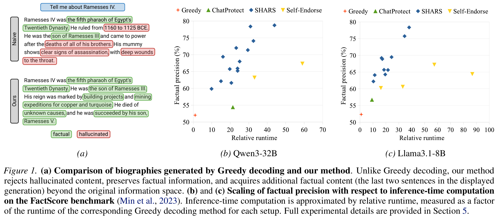

# Segment-wise HAllucination Rejection Sampling (SHARS)

Official implementation of the paper: **"Building Reliable Long-Form Generation via Hallucination Rejection Sampling"** (ICML 2026). arXiv: https://arxiv.org/abs/2606.03628. 



## 📌 Overview

**SHARS** is a plug-and-play, inference-time compute framework designed to mitigate hallucination accumulation ("hallucination snowballing") in long-form text generation. Unlike standard best-of-N rejection sampling, SHARS operates **segment-wise** (sentence by sentence) during the generation process:  

1. **Segment-wise Verification**: As each sentence is produced, a hallucination detector assesses its factuality.  
2. **Dynamic Actions**: Fully hallucinated sentences are discarded. Sentences mixing factual and hallucinated content are dynamically **rewritten** using only verified claims.  
3. **Information Space Exploration**: If stuck, the framework leverages the **Following strategy** to temporarily retain rejected paths during sampling, guiding the model to tap into alternative, truthful parametric knowledge spaces.  

To instantiate this framework, we also provide **HalluSE** (Hallucination via Semantic Entropy), an uncertainty-based detector optimized for long-form generation by decomposing sentences into strict entity-claim pairs.

## 🚀 Key Features

- **Detector-Agnostic:** Operates with any black-box hallucination detector.  
- **Zero-Resource/Zero-Shot:** Operates entirely on the model's internal parametric confidence without forcing external search engine or knowledge graph dependencies.  
- **Inference Compute Scaling:** Shows a clean scaling property—allocating more test-time compute budget yields consistently higher factual precision.  

## 🛠️ Installation

```bash
# Clone the repository
git clone https://github.com/TreeLLi/hallucination-rejection-sampling.git
cd hallucination-rejection-sampling

# Create a virtual environment
conda create -n shars python=3.11
conda activate shars

# Install PyTorch following https://pytorch.org/get-started/locally/
pip install torch (this should be adapted to your setup)

# Install required packages
pip install -r requirements.txt
```

### Main Dependencies

- `transformers >= 4.51.0`

- `torch >= 2.7.0` 

  We developed on the above versions, but should be compatible with earlier versions.

## ⚙️ Usage Instructions

### 1. Generation Baselines and Framework Run

Execute generation pipelines directly through the core CLI runner `main.py`.

#### Naive Decoding Generation (Baseline)

To generate text using standard baseline decoding configurations with no rejection filtering:

```bash
python main.py \
    -d factscore \
    -m qwen3-32b \
    -t 0.7 0.8 0.9 1.0 \
    -p 0.8 \
    -k 20 \
    -g naive
```

#### SHARS Generation (Ours)

To run text generation via the SHARS framework:

```bash
python main.py \
    -d factscore \
    -m qwen3-32b \
    -t 0.7 0.8 0.9 1.0 \
    -p 0.8 \
    -k 20 \
    --resample-policy natural \
    --rewrite \
    --uncertainty-threshold 0.7 \
    --n-questions 1 \
    --n-answers 3
```

#### CLI Generation Argument Breakdown

- `-d`, `--dataset`: Target benchmark dataset (`factscore` or `longfact`).  
- `-m`, `--model`: Model ID, see `LLM.py` for the list.  
- `-t`, `--temperature`: Sequence generation exploration parsing temperatures.
- `-g`, `--generator`: Core generation strategy framework (`naive` or `uncertainty`).
- `--resample-policy`: Method for resampling text when a validation failure occurs (`natural` implements the paper's *Following* strategy).  
- `--rewrite`: Activates self-correction formatting blocks to extract verified tokens and discard noise.  
- `--uncertainty-threshold`: Maximum allowed semantic entropy $\theta$ limit before marking an element as hallucinated.  
- `--n-questions`: Total number of downstream validation questions $Q$ mapped per extracted entity.  
- `--n-answers`: Total number of generation paths $A$ sampled to compute localized semantic entropy clusters.  

### 2. Downstream Benchmark Evaluation

Once your generation files are produced, compute the factual precision using the official benchmark evaluation setups.

#### FactScore Evaluation

To compute the fine-grained atomic factual precision of your generation outputs using the FactScore framework:  

```bash
cd third_eval/FActScore/
python -m factscore.factscorer submrg5b (replace run ID in WandB) --openai_key ./openaikey.txt
```

## 🏛️ Citation

If you find this framework beneficial for your work, please cite our work:  

Code snippet

```
@inproceedings{li2026building,
  title={Building Reliable Long-Form Generation via Hallucination Rejection Sampling},
  author={Li, Lin and Channing, Georgia and Bhat, Suhaas M and Jones, Gabriel Davis and Gal, Yarin},
  booktitle={Proceedings of the 43rd International Conference on Machine Learning (ICML)},
  year={2026},
  organization={PMLR}
}
```

For questions or issues regarding the codebase, please open an issue or reach out to Lin Li.  